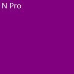

<div align="center">
  
  
  # Notifications Pro

  **A privacy-first, highly-customisable Windows notification overlay.**
  
  [](#requirements)
  [](#build--run--test)
  [](#privacy--data-model)
  [](#accessibility)
  [](LICENSE)
  [](docs/STATUS.md)
</div>

---

A privacy-first Windows tray app (C# .NET 8 + WPF) that captures native Windows toast notifications and mirrors them into a fully customisable, always-on-top overlay. It is especially useful on 4K, 5K, ultrawide, and multi-monitor setups where default Windows toasts are easy to miss. Filter noise, style cards per app, narrate only the alerts that matter, and keep notification text RAM-only by default. If you explicitly enable Session Archive, Notifications Pro also keeps a temporary in-memory archive for the current app session so you can review or copy recent captured notifications; it is never written to disk and is cleared when the app closes.

> Still in active development. I use it every day. More updates coming.

## Quick Start

1. Download the latest **`.msix`** package and matching **`.cer`** certificate from [GitHub Releases](https://github.com/lwytch/Notifications-Pro/releases).
2. Install the certificate only if you trust the release and want Windows to trust that package signature, then install the `.msix`.
3. Launch Notifications Pro and grant Windows notification access when prompted.
4. If live notifications still do not appear, open `Settings > System > Notification Access` and use `Retry Access Check` or switch `Capture Mode` to `Force Accessibility`.

## Why Notifications Pro Instead of Default Windows Notifications?

| Default Windows notifications | Notifications Pro |
|------------------------------|-------------------|
| Small transient toasts that are easy to miss on 4K/5K/ultrawide displays | A resizable always-on-top overlay you can place exactly where you want, including a dedicated side monitor |
| One-size-fits-all presentation | Per-app icons, sounds, card backgrounds, typography, timestamps, density, and grouping controls |
| Limited control over what breaks focus | App mute, field-scoped rules, app-filtered rules, deduplication, quiet hours, burst protection, and focus mode |
| No dedicated notification workspace | Put notifications on any monitor, use a fullscreen backdrop on a spare display, or pin the overlay to a consistent corner |
| Basic speech/accessibility control | Built-in narration, per-app read aloud, rule-gated speech, Voice Access labels, auto-duration, and accessibility-aware styling |
| System decides when to dismiss toasts | Persistent cards, auto-duration, hover-to-pause, and explicit visible-card limits |
| Overflow and history behavior are opaque | RAM-only visible cards, overflow count only, and no disk history of notification content by default |

Notifications Pro is built for people who need more control than Windows offers out of the box: developers watching builds and reviews, social/community managers tracking mentions, streamers keeping alerts readable on a second screen, and anyone using a high-resolution desktop where standard toasts disappear too quickly or too far into the corner.

## 🎯 Who is this for?

| Role | Why You Need It |
|------|-----------------|
| **Streamers & Creators** | Read chat and alerts on a single monitor while maintaining full-screen gaming focus. Use OBS Chroma-key integration for seamless stream overlays. |
| **Developers & Engineers** | Catch CI/CD build failures, PR reviews, or server alerts while deep in focus mode. Texts aren't truncated like default Windows toasts. |
| **ADHD & Neurodivergent** | Never lose a thought. Persistent notifications ensure you decide when a reminder disappears, not an arbitrary 5-second timer. |
| **Professionals** | Filter noise. Auto-mute Slack during meetings, but highlight "urgent" emails in red so you only break focus for emergencies. |
| **Social & Community Managers** | Monitor brand mentions, DMs, and engagement across platforms like X (Twitter), Discord, and Reddit without drowning in browser tabs. |

---

## Feature Overview

### Notification Capture
- **WinRT listener** (`UserNotificationListener`) — the primary capture path, requires a one-time permission grant via Windows Settings.
- **Accessibility fallback** — uses `SetWinEventHook` + UI Automation to read toast text when the WinRT path is unavailable (e.g. unpackaged app restrictions). Simultaneous notifications are split into individual entries rather than merged.
- **Capture mode selector** — `Settings > System > Notification Access` now offers `Auto`, `Prefer WinRT`, and `Force Accessibility` so you can recover quickly if live notifications stop flowing through the direct path.
- **Polling guard** — a 2-second polling loop supplements the event-driven path for reliability; a flag prevents overlapping polls.
- **Toast suppression** (optional) — after capturing a notification, the app can remove the native Windows toast popup so only the overlay shows. The WinRT path now attempts removal before the overlay card is queued to reduce visible flashing, and Notifications Pro ignores its own startup/self toasts so suppression does not bounce the app’s tray balloon back into the overlay. Requires the WinRT path. Off by default.

### Overlay Window
- Always-on-top, transparent, borderless — sits over any application.
- **Click-through mode** — overlay is visually present but all mouse events pass through to whatever is beneath.
- **Drag anywhere** — click and drag the overlay to reposition. Right-click a notification card for a context menu (dismiss, copy text, clear all, mute app).
- **Click-to-dismiss** — left-click a card to remove it.
- **Hover-to-pause** — hovering over the overlay pauses all expiry timers so you can finish reading before cards disappear.
- **Multi-monitor support** — place the overlay on any connected display; it remembers which monitor.
- **Quick position + monitor move** — `Settings > Layout` can move the overlay directly to a selected monitor and snap it to common corners/edges without manual dragging.
- **Edge snapping** — configurable snap distance; overlay aligns to screen edges when dragged nearby.
- **Manual resize** — drag the left or right edge of the overlay to change its width. Resize anchors to the edge it is near so right-aligned overlays do not jump.
- **Fullscreen overlay mode** — expands the overlay to cover an entire monitor with a configurable semi-transparent backdrop (solid colour or local image, with opacity and fit controls). Useful as a dedicated notification monitor or for focus sessions.
- **OBS fixed-window mode** — locks the overlay to a precise width/height for predictable window-capture in OBS/streaming tools.

### Layout Modes
- **Stacked cards** — each notification is a separate card, and the optional scrollbar applies when the currently visible cards need more vertical space.
- **Single-line banner mode** — a compact banner-style layout. Keep each notification to one line, or allow wrapping up to a configurable max-line count. Timestamps can render inline when enabled.
- **Replace mode** — globally available text-replacement rendering that works across all layout modes.
- **Text alignment** — choose Left / Center / Right alignment for stacked cards, wrapped banner cards, and the live preview.
- **Newest-on-top** toggle — controls whether new notifications appear at the top or bottom.
- **Retained notifications** — configurable 1–1000 retained cards, with new installs/reset defaults now starting at `40`. Extra notifications increment a `+N not shown` summary instead of being retained, and clicking that summary can raise the limit for future cards. The themed scrollbar is enabled by default for fresh installs but only appears when the retained cards overflow the overlay height; it does not resurrect discarded overflow items.
- **Max overlay height** — the overlay expands vertically up to this limit, then shows a scrollbar. Clamped to the active monitor work area.
- **Width / height presets** — quick buttons for 1080p / 2K / 4K / 8K display sizes.

### Appearance & Theming
- **Built-in theme presets** — select from a dropdown and apply in one click.
- **Custom themes** — save your current overlay look by name; re-apply or delete any time.
- **Import / export** — share a complete settings profile as a JSON file. Filtering rules, settings-window theme state, settings-window display mode, and compact-window mode round-trip cleanly, while managed custom assets are stored as relative Notifications Pro references instead of machine-specific absolute paths.
- **Named profiles** — save, load, and delete full profile snapshots from the Profiles tab or tray menu, including filtering rules, settings-window styling, popup/window behavior, and the same portable managed-asset references used by settings export/import.
- **Typography** — independently configure font family, size, and weight for app name, title, and body text. Line spacing control.
- **Timestamps** — optional per-card timestamps in Relative (`2m ago`), Time (`14:35`), or DateTime format, with independent size, weight, and colour.
- **Colours** — independent hex colours for title, app name, body text, background, and accent stripe.
- **Background opacity** — from fully opaque to near-transparent.
- **Card background images** — optional local image per stacked notification card with explicit `Solid / Image` mode plus opacity, hue, brightness, saturation, contrast, black-and-white, fit, coverage, and vertical-focus controls. You can keep the image inside the padded content area or let it span the full card, while the normal background colour remains the fallback base.
- **Card shape** — corner radius, internal padding, card gap, outer margin.
- **Grouping appearance** — grouped notifications can render as a `Framed Group`, `Header Chip`, or `Minimal Label`, with optional per-group counts, while reusing the normal accent/border/text styling controls.
- **Accent stripe** — 3 px coloured bar on the left edge of each card.
- **Optional border** — thin border around each card, configurable colour and thickness.
- **Highlight styling** — matched highlight rules can add configurable tint opacity, explicit highlight border width, choose a full border / accent-side-only / no-border frame, optionally play `Flash`, `Pulse`, or `Shake`, and individual highlight rules can override those treatments directly from `Settings > Filtering`. `Send Highlight Preview` lets you verify the current highlight styling locally without waiting for a real toast.
- **Per-app tint** — subtle colour tint on each card based on the source app name.
- **Icons** — optional per-app icons using 10 built-in vector presets (Bell, Megaphone, Star, Warning, Info, Heart, Lightning, Fire, Chat, Checkmark) or your own image files. Icon size configurable 16–48 px.
- **Dyslexia-friendly font** — bundled OpenDyslexic typeface with one-click preset buttons in `Appearance > Typography`. It is packaged as an app-local Notifications Pro resource rather than installed into Windows system fonts. See [THIRD_PARTY_NOTICES.md](THIRD_PARTY_NOTICES.md).
- **Apps tab overrides** — assign per-app `Read aloud`, sound, icon, and card-background overrides once Notifications Pro has seen that app, with app search, `Only modified`, and one-click reset.
- **Apps tab stability** — per-app override controls now bind directly to the settings window, avoiding the repeated WPF popup-binding errors that could appear when opening the `Apps` tab.
- **Chroma key** — solid-colour background (green / blue / magenta / custom) for OBS chroma-key filtering.
- **Information density presets** — Compact / Comfortable / Spacious — adjusts typography, spacing, and line limits in one click from the `Appearance` tab.

### Behaviour & Control
- **Notification duration** — configurable display time in seconds; each card has its own timer.
- **App grouping** — optional grouping by source app, with a separate appearance control so the grouping behaviour lives in `Behavior` and the styling lives in `Appearance`.
- **Persistent notifications** — disable auto-expiry; cards stay until manually dismissed.
- **Auto-duration** — extends display time based on notification length (configurable base seconds + seconds-per-line).
- **Animations** — choose from `Slide + Fade`, `Slide`, `Fade`, `Drift + Fade`, `Zoom + Fade`, or `Pop`; directional styles still respect Left / Right / Top / Bottom, duration is configurable up to `1200ms`, and motion easing can use `EaseOut`, `Bounce`, `Elastic`, or `Linear`.
- **Deduplication** — suppress identical notifications within a configurable time window.
- **Quiet hours** — block all notifications between configurable start/end times (supports overnight ranges).
- **Burst protection** — cap the number of notifications accepted in a sliding time window to avoid floods.
- **Always-on-top** — toggle without restarting; also available from the tray menu.

### Filtering & Smart Control
- **Per-app mute** — silence notifications from specific apps. Muted-app choices are saved in settings, and the Settings UI also shows apps seen this session for quick management.
- **Field-scoped keyword rules** — highlight or mute rules can target `Title Only`, `Body Only`, or `Title + Body`, with optional regex matching.
- **App-filtered rules** — highlight, mute, and narration rules can be limited to a specific app name such as `X`, `Outlook`, `Slack`, `Codex`, or `Antigravity`.
- **Editable rule cards** — highlight, mute, and narration rules can all be edited in place after creation, and the Filtering tab now keeps those editors in a compact-friendly single-column layout instead of squeezed multi-column rows.
- **Narration rules** — optional read-aloud overrides can force `Read Aloud` or `Skip Read Aloud` for matching notifications, with an optional spoken-content override and a mirrored `Only speak matching rules` toggle in `Settings > Filtering`.
- **Local highlight preview** — `Settings > Filtering > Send Highlight Preview` injects a local highlighted test card so you can verify tint, border, and animation changes immediately.
- **Focus mode** — a timed DND period (configurable minutes) accessible from the tray menu.
- **Presentation mode** — auto-DND when a configured app (PowerPoint, Zoom, Teams, etc.) goes fullscreen.

### Sounds
- **Master toggle** for notification sounds.
- **Windows sound list** — Notifications Pro enumerates the Windows sound events currently exposed in the registry, deduplicated by WAV path, so you can pick from the sounds your machine actually exposes instead of a hardcoded short list.
  > Note: Windows 11 unified many system sound events, so some choices may still produce the same audio. For distinct sounds use a custom WAV file.
- **Custom WAV files** — browse for any `.wav` file; stored under `%AppData%\NotificationsPro\sounds\`.
- **Per-app overrides** — assign a different sound to each app. Imported settings and saved profiles now trust only Windows system sounds or files inside Notifications Pro’s managed sounds folder.
- **Test button** — play the current default sound immediately.

### System Integration
- **Start with Windows** — enables/disables the packaged Windows Startup Task for Notifications Pro.
- **Notification access recovery** — the System tab shows current capture status, includes buttons to open Windows notification access, retry the direct WinRT access check, and run a capture diagnostic, and exposes `Auto`, `Prefer WinRT`, and `Force Accessibility` capture modes.
- **Session archive** — optional, off by default, and still RAM-only. When enabled, Notifications Pro keeps a temporary in-memory list of captured notifications for the current app session so you can review them in Settings or use the explicit copy actions in Settings and the tray menu to send them to the Windows clipboard. Notifications Pro does not save that archive to files or databases, and clears it when the app closes.
- **About dialog** — tray menu About shows the installed version, package identity, listener mode/status, runtime version, and project link.
- **Tray quick actions** — the tray menu can show/hide the overlay, pause notifications, toggle always-on-top / click-through, start focus mode, clear all, quick mute seen apps, and switch saved themes or profiles.
- **Tray listener health** — tray tooltip surfaces the active listener mode plus current status details for faster troubleshooting.
- **Global hotkeys** — register system-wide keyboard shortcuts for: toggle overlay visibility, dismiss all notifications, toggle Do Not Disturb.
- **Settings undo/redo** — Ctrl+Z and Ctrl+Y with a 50-entry history stack, plus undo/redo buttons in the settings header.
- **Settings window theming** — Dark / Light / System / any named overlay theme. Colours are fully customisable (background, surface, text, accent, border), and you can link the overlay theme and settings-window theme when you want both to move together.
- **Settings popup mode** — settings window can open as a normal resizable window or as a popup above the taskbar corner, with optional auto-close and a compact-width layout.
- **Quick tips toggle** — `Settings > Settings Window` can turn the first-run guidance banner on or off without affecting notification capture.

### Accessibility
- **Accessibility mode** toggle — enables persistent notifications + system motion/contrast/text-scaling respect in one click.
- **Respect Reduce Motion** — disables slide animations when Windows "Reduce Motion" is active.
- **Respect High Contrast** — adapts overlay colours when Windows High Contrast is active.
- **Respect Text Scaling** — scales notification text with the Windows text-size accessibility setting.
- **Auto-duration** — longer notifications stay visible longer so there is time to read them.
- **Spoken notifications** — built-in narration can read multiple title/body/timestamp combinations, using every voice Windows currently exposes to Notifications Pro through its app and desktop speech APIs, with adjustable speed, volume, preview, explicit trigger mode, a mirrored `Only speak matching rules` toggle in `Filtering`, and per-app `Read aloud` checkboxes in `Settings > Apps`. Each visible card is spoken once, so newly arriving cards do not replay cards that already finished speaking.
- **Microsoft Voice Access labels** — choose `Off`, `Body Only`, or `Title + Body + Timestamp` for the card-level UI Automation label used by Voice Access and similar assistive tools.
- **Keyboard navigation** — Alt-key mnemonics for every settings tab, Escape to close, and full tab-cycle navigation across all controls.
- **Scrollable overlay** — when visible cards exceed the max height, a clickable themed scrollbar keeps those visible cards readable without giving up drag-anywhere behavior on the rest of the overlay. It stays hidden while the idle `Waiting for notifications...` placeholder is showing.
- **Overlay scrollbar customisation** — show/hide scrollbar, configurable width, opacity, track/thumb colours, inset padding, card-to-scrollbar gap, and corner radius, all carried by overlay themes.
- **Bundled accessibility font notice** — OpenDyslexic is included only for Notifications Pro itself and is not registered system-wide. See [THIRD_PARTY_NOTICES.md](THIRD_PARTY_NOTICES.md) for attribution and license details.

### Automation & Scheduling
- **CLI arguments** — `--pause`, `--resume`, `--theme <name>`, `--send-test`, `--hide`, and `--show` can control the app from shortcuts or scripts.
- **Theme scheduling** — automatically switch between day/night themes on a configured schedule.

---

## Common Use Cases

### Streaming / OBS
Keep notifications readable on-stream without disrupting your layout:
1. Settings > Streaming — enable **Chroma Key**, pick a key colour (Green / Blue / Magenta).
2. Settings > Streaming — enable **OBS Fixed Window Mode**, then set width and height to match your capture dimensions.
3. In OBS, add a **Window Capture** source for the overlay, then add a **Chroma Key** filter using the matching colour.
4. Use **Per-app icons** and **Per-app tint** so viewers can instantly identify which app each notification is from.

### Presenting / Meetings
Avoid distraction without missing urgent messages:
- Enable **Presentation Mode** — the app auto-pauses notifications when PowerPoint, Zoom, Teams, or any configured app goes fullscreen.
- Use **Quiet Hours** to block notifications during scheduled meeting blocks.
- Use **Keyword highlight** so words like "urgent" or "fire" still break through even in focus mode.

### Gaming / Fullscreen Apps
- Enable **Click-through** so the overlay never steals focus mid-game.
- Use **Per-app mute** to silence low-priority apps while keeping alerts from important ones.
- Position the overlay in a corner that does not overlap your HUD.
- Use **Single-line banner mode** with a wide overlay for minimal screen real-estate.

### Accessibility & Readability
- Enable **Accessibility Mode** for a sensible bundle of defaults (persistent cards, motion/contrast/scaling respect).
- Increase body/title font size for large monitors or vision needs.
- Use **Auto-duration** so you are never rushed to read a long notification.
- Enable **Density: Spacious** for larger tap targets and more breathing room between elements.
- Turn on **Settings > Accessibility > Read Notifications Aloud** if you want Notifications Pro itself to narrate incoming notifications.
- Use **Timestamps** in DateTime mode to track when notifications arrived.
- Use **Settings > Accessibility > Microsoft Voice Access** to expose either a generic card label, the notification body only, or the title + body + timestamp through Windows accessibility APIs.

### Monitoring & Alerts
- Set up **Keyword highlight** for terms like `failed`, `down`, `critical`, `error`, `urgent`.
- Enable **Sounds** for specific apps (e.g., a monitoring tool) while keeping others silent.
- Use **Burst limiting** so a flood of alerts from a runaway process does not bury the overlay.
- Set **Retained Notifications** high and **Duration** long so alerts accumulate until acknowledged.
- Use **Persistent Notifications** for critical alerts that must not auto-expire.

### Daily Communications (Teams / Slack / Discord / Outlook)
- Long chat messages, email previews, and calendar reminders display in full — no truncation.
- Use **Per-app mute** to silence low-signal channels at certain times.
- Right-click a card to copy the full notification text to the clipboard.
- Use **Deduplication** to suppress rapid-fire duplicate messages from chatty threads.

### Social Media & Community Management (X / Reddit / Instagram)
- Track mentions, replies, and DMs without keeping heavy browser tabs open or switching contexts.
- Use **Keyword highlight** for your brand name or specific campaign hashtags so you never miss an important engagement.
- Use **Deduplication** and **Burst limiting** to filter out rapid-fire "liked your post" storms while keeping meaningful comments visible.
- Keep the overlay tucked in the corner of your screen to passively monitor community health while working on other tasks.

---

## Workflow Guides

### Getting the Most Out of Notifications Pro
- Start with `Settings > System > Notification Access` and keep `Capture Mode` on `Auto` unless live notifications stop appearing. If preview notifications work but real ones do not, switch to `Force Accessibility`.
- Use `Settings > Filtering` for targeting logic, `Settings > Apps` for per-app presentation overrides, `Settings > Accessibility` for voice/rate/output choices, and `Settings > Appearance` for how stacked cards look.
- If you want the app itself to speak, turn on `Settings > Accessibility > Read Notifications Aloud`. Then use either `Settings > Accessibility > Narration Trigger` or `Settings > Filtering > Only speak matching rules` when speech should happen only for rule matches instead of for every allowed app.
- Use `Settings > Filtering > Send Highlight Preview` whenever you adjust highlight tint, border mode, animation, or per-rule overrides and want to verify the look immediately.
- Background images are local-only assets copied into Notifications Pro's backgrounds folder. Stacked cards can use fit and coverage controls, single-line banner mode stays solid-colour for readability, app-specific overrides live in `Settings > Apps`, and shared exports/profiles keep those managed assets as relative Notifications Pro references instead of leaking machine-specific absolute paths.
- If browser-hosted services all look like one browser app, install those sites as browser apps/PWAs first so Windows can surface a cleaner app identity when the browser supports it.

### Getting the Most Out of X
- Browser-hosted X notifications usually surface as plain Windows notification text: `AppName`, `Title`, and `Body`. Notifications Pro does not receive structured account IDs or post metadata from X itself.
- If X is arriving as a generic browser host, install it as a browser app/PWA first. Chrome’s desktop app flow is here: [Install or manage apps in Chrome](https://support.google.com/chrome/answer/9658361?co=GENIE.Platform%3DDesktop&hl=en). Edge also supports installable apps here: [Install as app from Microsoft Edge](https://learn.microsoft.com/en-us/microsoft-edge/progressive-web-apps-chromium/how-to/install). In practice, if X notifications are inconsistent in Edge on your machine, Chrome remains the safer workflow.
- Use `Settings > Filtering > Highlight Rules` with `Match Scope` set to `Title Only` or `Body Only` depending on where the account name or watchword usually appears in your Windows notifications.
- Use literal keywords like `@openai`, `@nvidia`, or a campaign hashtag when the text is stable. Turn on `.*` only when you really need regex patterns.
- Add `App Filter = X` if you want X-specific rules without affecting Outlook, Reddit, Slack, or other notification sources using similar words.
- Use `Settings > Filtering > Narration Rules` if only certain handles, phrases, or alerts should be spoken aloud while the rest of X stays visual-only. If speech should happen only for those matches, turn on `Only speak matching rules`.

### Other Social Platforms
- The same rule system works for Reddit, Instagram, Discord communities, and browser-hosted social tools, but the exact usable keywords depend on what Windows puts into the `Title` and `Body`.
- For moderation or community work, use `Body Only` rules for phrases like `reported`, `reply`, `mention`, or a subreddit/community name, then add an app filter if the same phrase appears in unrelated apps.
- Use per-app `Read aloud` checkboxes in `Settings > Apps` when an entire platform should stay silent, then add narration rules only for truly high-signal posts or messages.
- When several services all arrive through the same browser host, rely on text patterns and app filters rather than assuming Notifications Pro can distinguish accounts structurally.

### Common Notification-Heavy Tools
- Tools like Codex, Antigravity, CI dashboards, repo alerts, and monitoring systems work best with field-scoped rules instead of broad global keywords. Match the exact repo name, environment name, or failure phrase where it usually appears.
- Use `Title Only` rules for concise build/status subjects, `Body Only` rules for longer deployment or tool output phrases, and app filters when several tools share similar wording.
- Pair highlight rules with the built-in narrator carefully: keep the global spoken toggle on only for the apps you routinely care about, then use narration rules to elevate truly urgent phrases.
- If a tool is too noisy, mute it at the app level first, then reintroduce a small set of specific highlight or narration rules for the signals that matter.

---

## Why No Clickable Links or Images?

This is deliberate:
- **Safety**: an always-on-top overlay with clickable URLs increases the risk of accidental clicks and phishing. URLs render as plain text only.
- **Predictability**: Windows toasts can include action buttons and rich media. The overlay is intentionally passive (read / dismiss / copy) so behaviour is consistent across both the WinRT and accessibility capture paths.
- **Privacy**: rendering images from notification payloads would require decoding potentially remote content.

Per-app icons are user-configured (built-in vector presets or your own files) and are never sourced from notification payloads.

---

## Privacy & Data Model

Notifications Pro is designed to avoid persisting notification content:
- **No notification title or body is ever written to disk** — no database, no cache, no logs of notification text.
- Notification content exists only in RAM. By default, Notifications Pro keeps only the currently visible notifications on screen, releases each one after dismissal or expiry, and stores overflow as a count only. If you explicitly enable **Session Archive**, the app also keeps a temporary in-memory session list of captured notifications so you can review them or copy them while the app is running. Session Archive is off by default, is not saved by Notifications Pro to files or databases, and is cleared when the app closes.
- Using **Copy Text**, **Copy All to Clipboard**, or either Session Archive copy action hands the selected notification text to the Windows clipboard. Notifications Pro does not persist that text itself, but Windows clipboard history or third-party clipboard tools may retain copied text outside the app.
- The app makes **no network calls** and includes **no telemetry**.
- If **Spoken Notifications** is enabled, the text is spoken through your selected Windows audio output and may be audible to people nearby. Notifications Pro still keeps that text in RAM only and never saves spoken content to disk.
- Visible notification text is available to Windows accessibility tools while on screen. The Voice Access setting controls the card-level UI Automation label only; it does not save or transmit the text.

Windows may keep notification history in the Action Center independently. The optional toast-suppression feature removes captured notifications from the Action Center; leave it off to preserve Windows default behaviour.

### Files Written

Under `%AppData%\NotificationsPro\`:

| Path | Contents |
|------|----------|
| `settings.json` | App preferences and app-level overrides, including muted app names, but no notification title/body content |
| `themes\*.json` | Named custom overlay themes |
| `backgrounds\` | Optional user-provided background image files for cards and fullscreen backdrops |
| `icons\` | Optional user-provided icon image files |
| `sounds\` | Optional custom WAV files |

---

## Requirements

- Windows 10 or Windows 11
- .NET 8 SDK (to build from source) or .NET 8 Runtime (to run a published build)

## Build / Run / Test

```bash
dotnet restore src/NotificationsPro/NotificationsPro.csproj
dotnet restore tests/NotificationsPro.Tests/NotificationsPro.Tests.csproj
dotnet build src/NotificationsPro/NotificationsPro.csproj
dotnet run --project src/NotificationsPro
dotnet test tests/NotificationsPro.Tests/NotificationsPro.Tests.csproj
```

## Publish (self-contained)

```bash
dotnet publish src/NotificationsPro -c Release -r win-x64 --self-contained
```

---

## Installation (MSIX)

Notifications Pro is distributed as a native Windows App package (`.msix`). Because it relies on Windows package identity for the best notification-access behavior, the installer must be digitally signed. Current releases use a dedicated self-signed signing certificate for Notifications Pro.

To install it for the first time:
1. Download the matching **`.msix`** installer and **`.cer`** certificate from [GitHub Releases](https://github.com/lwytch/Notifications-Pro/releases).
2. Review the release source and certificate details. Install the certificate only if you trust this release and want Windows to trust that package signature.
   The public `.cer` may show subject `CN=LiamWytcherley`. That is the current package publisher / maintainer signing identity for Notifications Pro, and it is expected. The `.cer` contains only the public certificate used to verify the MSIX, not the private signing key.
3. Right-click the `.cer` file, choose **Install Certificate**, and place it in **Trusted Root Certification Authorities**.
4. If Windows still reports that the package signature is not trusted on your machine, import the same `.cer` into **Trusted People** as well, then retry the install.
5. Double-click the `.msix` file to install Notifications Pro.

> **Note on Windows Defender / SmartScreen:** 
> New self-signed binaries may trigger SmartScreen, Defender, or other antivirus reputation checks. Review the release source, publisher, and certificate before bypassing a warning. If you need an antivirus exclusion, keep it narrowly scoped to `NotificationsPro.exe` rather than broad folders or trust-wide changes.
> 
> How you manage trust and exclusions on your machine is your decision. Keep any exceptions as narrow as possible and avoid broad allowlists when a specific per-app rule will do.

---

## How To Use

### Tray Icon
Right-click the tray icon to access: show/hide overlay, pause (DND), always-on-top, click-through, focus mode timer, quick mute, theme quick-switch, profile quick-switch, clear all, open notification-access settings, retry access check, settings, quit.

### Overlay Interaction
| Action | Effect |
|--------|--------|
| Left-click a card | Dismiss it |
| Drag anywhere | Reposition the overlay |
| Hover | Pauses all expiry timers |
| Right-click a card | Context menu (dismiss, copy, clear all, mute app) |
| Drag left/right edge | Resize width (when manual resize is enabled) |

### Settings
Changes are debounced and auto-saved. Use **Send Test Notification** (Ctrl+T) to preview general styling without waiting for a real notification, and use **Settings > Filtering > Send Highlight Preview** when you want a local highlighted card for filter-specific styling checks. The header also exposes undo/redo, and **Reset to Defaults** asks for confirmation before replacing your current settings.

### Windows notification setup
Notifications Pro mirrors the notifications Windows is already surfacing. If Windows notifications are off for an app, there is nothing for the overlay to capture.

- Microsoft setup guide: [Change notification settings in Windows](https://support.microsoft.com/windows/change-notification-settings-in-windows-8942c744-6198-fe56-4639-34320cf9444e)
- In Notifications Pro, use `Settings > System > Notification Access` for `Open Windows Notification Access`, `Retry Access Check`, `Run Capture Diagnostic`, and `Capture Mode`.

### Browser-hosted apps and PWAs
If several services all show up as `Google Chrome`, `Microsoft Edge`, or another browser host, install the site as an app/PWA when the browser supports it. That gives Windows a better chance to surface a distinct app name instead of the shared browser host name.

- Chrome desktop app/PWA install: [Install or manage apps in Chrome](https://support.google.com/chrome/answer/9658361?co=GENIE.Platform%3DDesktop&hl=en)
- Microsoft Edge app/PWA install: [Install as app from Microsoft Edge](https://learn.microsoft.com/en-us/microsoft-edge/progressive-web-apps-chromium/how-to/install)
- Notifications Pro only sees the Windows app name, title, and body it receives. It does not get direct platform account IDs or browser-internal metadata.

### Spoken Notifications
In **Settings > Accessibility > Spoken Notifications**, turn on **Read Notifications Aloud** to make Notifications Pro narrate captured notifications itself.

Choose from `Body Only`, `Title Only`, `Title + Body`, `Body + Timestamp`, `Title + Timestamp`, or `Title + Body + Timestamp`. You can also choose whether narration should speak `All Allowed Notifications` or `Only Matching Narration Rules`, pick an available Windows voice, adjust rate and volume, and use **Preview Voice** or **Refresh Voices** immediately.

Per-app narration now lives in `Settings > Apps`, where each seen app has a `Read aloud` checkbox alongside its other app-specific overrides. Unchecked apps still stay visible on screen but are ignored by narration. If you need finer control, `Settings > Filtering > Narration Rules` can force `Read Aloud` or `Skip Read Aloud` for matching title/body text, optionally limited to a specific app. If you want speech only for rule hits, turn on `Only speak matching rules` in `Settings > Filtering` or switch `Narration Trigger` to `Only Matching Narration Rules` in Accessibility. Visible cards are spoken once, so new arrivals do not replay cards that already finished speaking.

Notifications Pro now lists every voice Windows exposes to it through the local app speech API and the desktop speech API. Some Narrator Natural voices may still be missing even after installation because Windows does not expose every Narrator voice to third-party app text-to-speech. Use **Refresh Voices** after installing new voices, or reopen the app if Windows still has not published the new voice list.

If you want to install more voices, Microsoft’s setup guides are:
- [Customize Narrator voices](https://support.microsoft.com/windows/chapter-7-customizing-narrator-6e30e2d0-b2f3-b907-d264-a5d30502ad73)
- [Supported Narrator languages and voices](https://support.microsoft.com/windows/appendix-a-supported-languages-and-voices-for-narrator-448ec015-eb18-4ac2-8d0d-fac74d441e3b)

This is the app's own text-to-speech feature. Audio plays through your default Windows output and can be heard by people nearby. Notifications Pro does not write spoken text to disk and does not keep overflow notification content for later playback.

### Microsoft Voice Access
In **Settings > Accessibility > Microsoft Voice Access**, choose `Off`, `Body Only`, or `Title + Body + Timestamp` to control the card-level Windows UI Automation label that Microsoft Voice Access can reference for visible notifications.

This is an accessibility integration, not a separate text-to-speech engine inside Notifications Pro. The selected text is only exposed while the card is on screen, stays in RAM only, and is never written to disk, logged, or sent over the network.

---

## Notification Access

On first run, Windows will prompt for notification access. If you denied it or it was not granted:
1. Open **Windows Settings → Privacy → Notifications** (or search for `notification access`).
2. Find the notification listener / notification access section.
3. Enable access for **Notifications Pro**.

Official Windows help:
- [Change notification settings in Windows](https://support.microsoft.com/windows/change-notification-settings-in-windows-8942c744-6198-fe56-4639-34320cf9444e)

The tray menu also has **Open Privacy > Notifications...** and **Retry Access Check** for troubleshooting.

The same recovery controls now appear in **Settings > System > Notification Access**, alongside the current capture-mode status and a manual `Auto` / `Prefer WinRT` / `Force Accessibility` selector.

If live notifications stop appearing while preview/test notifications still work, switch `Capture Mode` to `Force Accessibility` first. That is the intended recovery path for WinRT delivery stalls or false-positive access states.

---

## Troubleshooting

| Symptom | Fix |
|---------|-----|
| No notifications captured | Verify permission, then use tray "Retry Access Check". If test notifications work but live ones do not, open **Settings > System > Notification Access**, run **Capture Diagnostic**, and switch **Capture Mode** to `Force Accessibility`. |
| Can't drag the overlay | Click-through is on. Disable from the tray menu or Settings > Layout. |
| Windows toasts stop appearing | Ensure "Suppress Toast Popups" is off in Settings > System. |
| System sounds all sound the same | Windows 11 unified many system sound events. Use a custom WAV for distinct sounds. |
| Overlay disappears off-screen | Use Settings > Layout > Quick Position presets to move it back. |
| Notifications are not read aloud | Turn on **Settings > Accessibility > Read Notifications Aloud**, then use **Preview Voice**. If you still hear nothing, check your Windows output device, ensure notifications are not paused, confirm the app is still checked in **Settings > Apps > Read aloud**, and verify that **Settings > Filtering > Only speak matching rules** or `Narration Trigger = Only Matching Narration Rules` is not enabled unless you actually have a matching `Read Aloud` rule. |
| A highlight, mute, or narration rule is affecting the wrong app | Open **Settings > Filtering** and add or tighten the optional **App Filter** so the rule only matches the intended source such as `X`, `Outlook`, `Slack`, `Codex`, or `Antigravity`. |
| Everything shows up as `Google Chrome` or `Microsoft Edge` | Install the site as a browser app/PWA so Windows can surface a more specific app identity when the browser supports it, then wait for the next live notification. |
| Voice Access only sees "Notification" | Change **Settings > Accessibility > Microsoft Voice Access** from `Off` to `Body Only` or `Title + Body + Timestamp`. |

---

## Project Docs

- [`docs/STATUS.md`](docs/STATUS.md) — current capabilities and manual test checklist
- [`docs/PLAN.md`](docs/PLAN.md) — milestones and roadmap
- [`docs/ARCHITECTURE.md`](docs/ARCHITECTURE.md) — component overview

---

## Disclaimer of Liability

**Notifications Pro is strictly provided "AS IS", without warranty of any kind.**  
While extensively tested, this software hooks into Windows UI Automation and notification systems. The authors and contributors cannot be held liable for any claim, damages, data loss, or other liability, whether in an action of contract, tort or otherwise, arising from, out of, or in connection with the software or the use or other dealings in the software. Please refer to the `LICENSE` file for the full legal text.

---

<details>
<summary><strong>Release Notes</strong></summary>

### Release v1.1.10.34
- Hardened local background image handling so custom card/fullscreen artwork now uses stricter managed-path validation and a bounded transformed-image cache during long styling sessions.
- Made Session Archive copy actions more explicit in the tray and settings flows, and tightened the public privacy/security wording around clipboard behavior plus what app-level metadata can still be saved in settings or profiles.
- Added 1 MB guardrails to normal startup settings and custom-theme JSON loads, with expanded regression coverage for the new hardening paths.

### Release v1.1.10.33
- Fixed `Settings Window` slider and live-binding refresh issues in popup mode by correcting the Settings Window theme property notifications. Opacity, surface, element, and corner-radius values now update their on-screen readouts reliably while you drag.
- Tightened the public README for first-time users with a clearer quick-start/install path, safer MSIX trust wording, explicit app-local OpenDyslexic disclosure, and more direct privacy wording around Session Archive behavior.
- Reset the in-README release notes to a fresh baseline so this section reflects the current app cleanly instead of carrying a long stale history.

</details>
